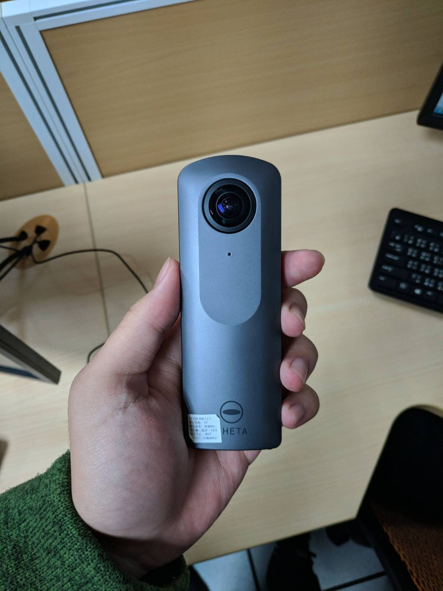
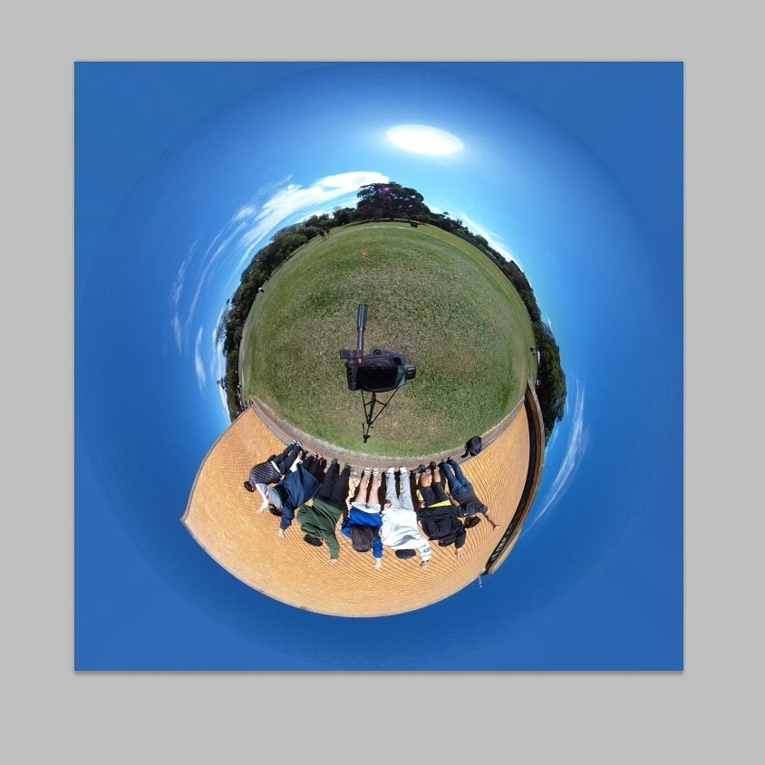
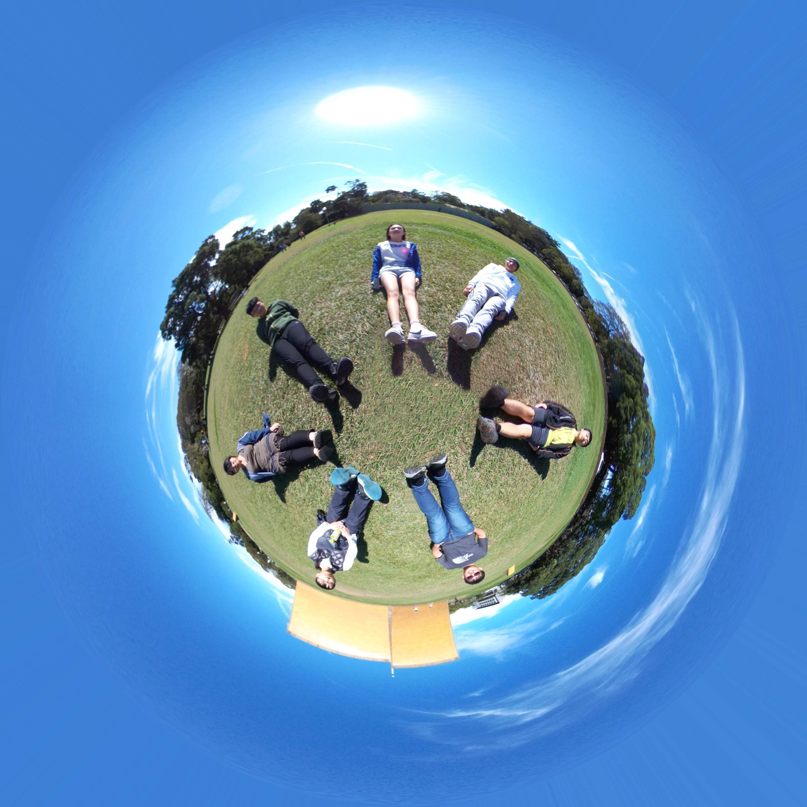
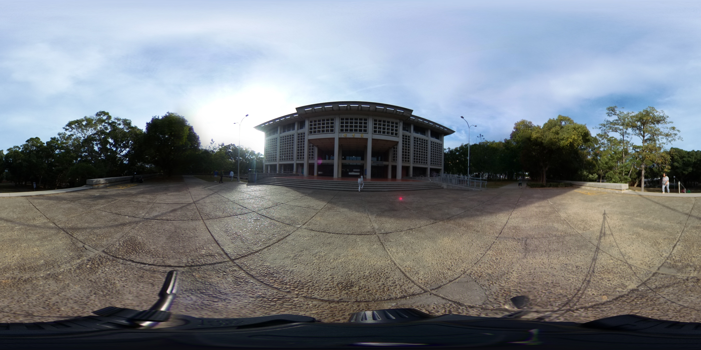
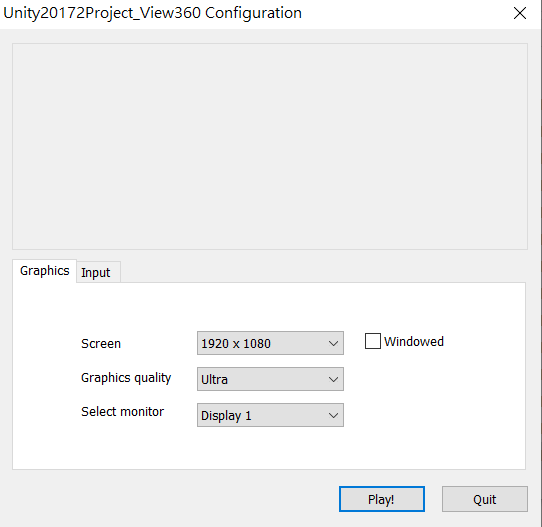
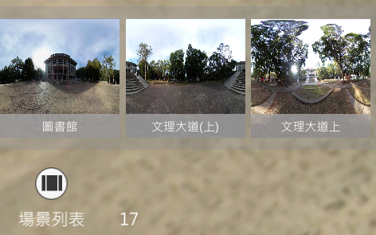
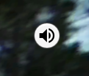

# 3D-AR-校園導覽
### 簡介 : 利用360相機結合PhotoShop完成所需素材，再透過Unity實現3D校園街景導覽，示意動畫如下:
 
### 本次欲導覽的地方為東海大學圖書館至文理大道(下) :
Start:起始地點 ，End:結束地點，C:創意學院，LAW:法學院，AG:農學院  
 
# 前置步驟: 蒐集素材->後製素材
1. 利用RICOH THETA V 360°環景攝影機至欲拍攝的地點拍攝 
 
2. 蒐集完後，會有許多未經加工的原始素材。因有上架腳做拍攝，避免每張照片因高度不同拚結實有斷層感，故每張照片底部都有拍到腳架。示意圖如下: 
 
3. 我們需要將圖裡腳架移除，因圖形是長方形不方便我們作業，故利用PhotoShop將圖片轉換成圓形。示意圖如下: 
 
4. 接著利用PhotoShop技巧，將腳架抹除。示意圖如下: 
 
5. 再將修改好後的圓形圖片轉換為原來的長方形，所以最後圖片會從這樣: 
 
變成這樣 : ) 
 
# 將素材匯進Unity: 
接下來的步驟呢? 嗯...有點小複雜，總之就是無止盡的寫腳本，串接個張圖檔，點擊按鈕會觸發什麼東西之類的，在這邊我是將全景圖部屬到Unity Sphere的3D空間內，在3D空間內進行操作，這樣使用者看起來才會有3D的感覺，彷彿自身其中。實際怎實作，大家可以載來研究看看。這專案2018年做的，筆者現在研究領域跟Unity沒什麼關聯了，很久沒使用Unity拉 ~~ 可能不太熟悉了😂😂 
# 該如何快速把玩此專案呢? 
1. 將 "東海360(執行檔).exe" + "東海360(執行檔)_Data" + "UnityPlayer.dll" 這三個檔案下載下來放在同個目錄下 
2. 執行 "東海360(執行檔).exe" 會出現以下畫面 ，並點擊Play就可以玩拉 ~~~  
 
3. 進入並載入完畢後底下有場景列表，總共分為17個場景，亦即有17張全景圖，如不需要場景列表可以點擊它將它關閉 
 
4. 另外如果覺得背景音效太吵可以點擊右上角將音效關閉 
 
# 檢討與改善: 
1. 圖與圖之間的拍照距離間隔過大，造成畫面移動有順移感。 
2. 切換場景時，動畫可以更加流暢。 
3. 效能可以提升，運行速度需更加流暢。 
4. 介面可以更加美化。 
# 感謝各位收看~~~
